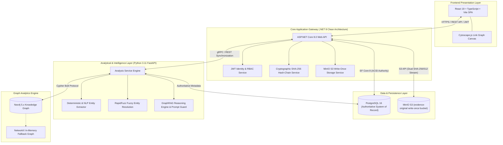

# EvidenceGraph

**Enterprise AI-Assisted Digital Evidence & Investigative Intelligence Platform**

[]()
[]()
[]()
[]()
[]()
[]()
[]()
[]()
[]()
[]()

> *"Evidence first. AI second. Trace every claim to an unassailable digital origin."*

EvidenceGraph is a production-grade digital evidence analysis and investigative intelligence platform engineered for law enforcement, cyber threat intelligence (CTI), financial crimes investigators, and digital forensics teams. 

Unlike generic generative AI tools or surface-level CRUD dashboards, EvidenceGraph enforces strict **chain of custody, cryptographic immutability, deterministic entity resolution, multi-hop knowledge graph traversal, and citation-grounded GraphRAG AI** that prevents hallucinations and guarantees forensic defensibility in judicial proceedings.

---

## Product at a glance

| Area | Implementation & Architecture |
| :--- | :--- |
| **System of Record (Authority)** | ASP.NET Core 8.0 Web API, Clean Architecture, EF Core 8, PostgreSQL 16 (Relational Legal Baseline) |
| **Analytical & Intelligence Engine** | Python 3.11, FastAPI, Pydantic v2, RapidFuzz, Deterministic Regex Parsers, NLP/NER Extractions |
| **Knowledge Graph Analytics** | Neo4j 5.26 Community (Derived Analytical Projection) with In-Memory NetworkX Fallback Engine |
| **Immutable Object Storage** | MinIO S3 (`evidence-original` write-once bucket) with on-the-wire dual `SHA-256` & `SHA-512` streaming |
| **Investigative Workspace (UI)** | React 18.3 / 19, TypeScript 5.7, Vite 6, Tailwind CSS 3.4, Cytoscape.js, Lucide Icons |
| **Audit & Cryptography** | Forward-linked cryptographic SHA-256 Hash Chain with real-time $O(N)$ mathematical tamper verification |
| **Grounding & AI Safety** | Citation-Grounded GraphRAG with deterministic deep-linkable chunk citations (`[EV-xxx §yy]`) & prompt injection defense |
| **Pre-Seeded Showcase Dossier** | Operation Northstar (`EG-2026-0042`): 50 synthetic evidence artifacts, 15 entities, 18 relationships, 7 verifiable discoveries |
| **Deployment & Delivery** | Multi-stage Dockerfiles, Docker Compose one-command orchestration, Nginx reverse proxy |

---

## Investigative workflow

```text
Evidence Ingestion & Dual Hash Computation (SHA-256 & SHA-512)
                      ↓
Immutable Object Storage (MinIO S3) & Authoritative Registration (PostgreSQL 16)
                      ↓
Deterministic Chunking & Entity Extraction (Regex + NLP Parsers)
                      ↓
Fuzzy Entity Resolution & Human-in-the-Loop Confirmation
                      ↓
Derived Analytical Graph Projection (Neo4j 5.x / NetworkX)
                      ↓
Citation-Grounded GraphRAG Analysis & Multi-Hop Shortest Path Discovery
                      ↓
Tamper-Evident SHA-256 Audit Trail Cryptographic Verification
```

---

## System architecture

EvidenceGraph employs a **Dual-Store Architecture** that cleanly isolates the **Authoritative System of Record** (PostgreSQL 16) from the **Derived Analytical Knowledge Graph** (Neo4j 5.x / NetworkX) and **Immutable Object Storage** (MinIO S3).



---

## What the platform includes

### 1. Case and evidence management
- **Centralized case workspaces**: Track case number, classification, status, priority, lead investigator, dates, and active hypothesis notes.
- **Multi-format evidence register**: Ingest and inspect forensic files, emails, call logs, financial ledgers, VoIP records, and surveillance transcripts.
- **Forensic metadata and EXIF extraction**: Automatically parse MIME types, file sizes, acquisition timestamps, hardware IDs, and EXIF camera data.
- **Live physical integrity verification**: Stream evidence bytes directly from MinIO S3 and re-calculate SHA-256 and SHA-512 hashes on demand to detect bitrot or tampering.
- **Deterministic text chunking**: Segment evidence documents into stable, byte-offset-indexed chunks with individual cryptographic hashes and bracketed anchors (e.g. `[EV-014 §2]`).

### 2. Entity extraction and human-in-the-loop resolution
- **Deterministic regex extractors**: High-precision extraction of RFC 5322 emails, E.164 phone numbers, IPv4/IPv6 addresses, FQDN domains, and cryptocurrency wallet addresses (Bitcoin, Ethereum).
- **NLP and Named Entity Recognition (NER)**: Identify Persons, Organizations, Locations, Financial Accounts, and Vehicles.
- **RapidFuzz fuzzy similarity resolution**: Cluster alias variations, typos, and nominee shell naming permutations across case files.
- **Human-in-the-Loop (HITL) confirmation lifecycle**: Extractions remain in a suggested/unconfirmed state until validated by an investigator, preventing unauthorized automated data pollution.

### 3. Interactive knowledge graph and link analysis
- **Cytoscape.js link graph canvas**: Visual graph workspace supporting Force-Directed (CoSE), Hierarchical (Dagre), and Concentric layout algorithms.
- **Multi-hop shortest path discovery**: Instantly identify hidden communication chains, shared intermediaries, and nominee corporate structures between any two entities.
- **Network centrality and degree metrics**: Compute betweenness centrality and connectivity degree to highlight operational command nodes.
- **Visual node states**: Confirmed entities and relationships render as solid nodes/edges; unconfirmed AI suggestions render as dashed amber outlines.
- **1-Click graph rebuild**: Reconstruct the entire Neo4j graph projection on demand from the authoritative PostgreSQL database.

### 4. Citation-grounded GraphRAG AI workspace
- **Grounded retrieval-augmented generation**: AI answers are strictly bounded by retrieved evidence text chunks and knowledge graph relationships.
- **Deep-linkable chunk citations**: Every AI assertion includes clickable citation badges (e.g. `[EV-001 §1]`, `[EV-014 §2]`) that immediately open the source document and highlight the exact text range.
- **Multi-layer prompt injection defense**: XML perimeter fencing, heuristic pre-scanning, and prompt-hardening prevent adversarial prompt overrides embedded in evidence documents.
- **AI Reasoning Trace inspector**: Full transparency into token consumption, inference latency, prompt template versions, and positive vs. negative confidence factor breakdowns.

### 5. Timeline reconstruction and contradiction detection
- **Chronological sequence engine**: Automatically map timestamps across emails, call records, financial transactions, and physical surveillance logs into an interactive timeline.
- **Automated contradiction detection**: Cross-reference claimed alibis with timestamped physical records (e.g. ATM withdrawals, cell tower pings) and flag discrepancies.
- **Conflict review banner**: Dedicated UI for comparing contradictory evidence items side by side with source citations.

### 6. Cryptographic audit trail and chain of custody
- **Tamper-evident SHA-256 hash chain**: Every user action, evidence upload, entity confirmation, note creation, and AI query appends to an immutable forward-linked cryptographic ledger:
  $$\text{EntryHash}_n = \text{SHA256}(\text{Seq} \mathbin{\Vert} \text{TimeUtc} \mathbin{\Vert} \text{UserId} \mathbin{\Vert} \text{Action} \mathbin{\Vert} \text{ResourceId} \mathbin{\Vert} \text{CanonicalJSON} \mathbin{\Vert} \text{EntryHash}_{n-1})$$
- **Global and case-level mathematical verification**: Single-click $O(N)$ ledger verification that validates sequential continuity and detects any record deletion or modification.

### 7. Security, identity, and role-based access control (RBAC)
- **Granular role hierarchy**:
  - `Lead Investigator`: Full case, evidence, entity confirmation, hypothesis notes, and AI analysis authority.
  - `Administrator`: System configuration, user provisioning, and global audit inspection.
  - `Senior Analyst`: Graph analytics, query execution, and entity suggestion review.
  - `External Reviewer`: Read-only access to case files, reports, and audit certificates.
- **Authentication**: Signed JWT bearer tokens with secure PBKDF2 password hashing.
- **Standardized error handling**: RFC 7807 Problem Details across all API endpoints.

---

## Demo case: Operation Northstar (`EG-2026-0042`)

EvidenceGraph comes pre-seeded with **Operation Northstar**, a realistic multi-jurisdictional financial fraud and shell network investigation featuring **50 synthetic evidence artifacts** (`EV-001` through `EV-050`).

### The 7 discoveries (verifiable in platform)
1. **Discovery A (Direct Communication)**: Alex Mercer contacted Jordan Ellis via encrypted VoIP call (`EV-001 §1`, `EV-014 §2`).
2. **Discovery B (Hidden Asset Transfer)**: Mercer diverted corporate funds through Northstar Holdings LLC and Meridian Trade Capital into Bitcoin wallet `1bc1q9x...` (`EV-005 §2`, `EV-012 §1`, `EV-028 §1`).
3. **Discovery C (Shared Burner Infrastructure)**: Mercer and Ellis both registered hotel stays and vehicle rentals using the same burner phone `+1-555-019-2834` (`EV-003 §1`, `EV-022 §1`).
4. **Discovery D (Nominee Corporate Cloaking)**: Elena Rostova was installed as nominal director while Mercer retained secret power of attorney (`EV-008 §1`, `EV-031 §3`).
5. **Discovery E (Command Node Attribution)**: Mercer accessed infrastructure through VPN IP `198.51.100.42` (`EV-019 §1`).
6. **Discovery F (Alibi Contradiction)**: Mercer claimed home presence between 13:00-15:00 (`EV-017 §1`), directly contradicted by ATM withdrawal at 13:47 (`EV-033 §1`).
7. **Discovery G (Crypto Mixer Trace)**: Multi-hop trace from USD wire to cryptocurrency mixer output (`EV-028 §1`, `EV-040 §2`, `EV-049 §1`).

---

## Interactive 12-step showcase walkthrough

Follow this 12-step sequence to experience the full operational capability of EvidenceGraph:

1. **Authentication**: Sign in as `investigator@evidencegraph.local`. Observe the institutional security banner and active badge number `INV-784`.
2. **Case Dashboard**: Review Case `EG-2026-0042` (*Operation Northstar*). Inspect KPI metrics (50 Evidence Items, 15 Entities, 18 Relationships, 1 Flagged Conflict).
3. **Evidence Archive**: Navigate to `/evidence`. Filter by `Document`, `Email`, or `CallRecord`. Observe SHA-256 digests and acquisition timestamps.
4. **Physical Integrity Verification**: Click on `EV-014`. Open the *Integrity Verification* tab and execute real-time physical verification. Observe the live byte-stream SHA-256 match.
5. **Deterministic Chunk Deep Links**: Switch to the *Extracted Text & Chunks* tab. Inspect stable chunk tags (e.g., `[EV-014 §2]`) with individual text hashes.
6. **Entity Resolution & Extraction**: Navigate to `/entities`. Filter by `Person` and `PhoneNumber`. Note how `+1-555-019-2834` resolves across both Mercer and Ellis.
7. **Interactive Link Graph (Cytoscape.js)**: Navigate to `/graph`. Switch layouts between `Force-Directed (CoSE)`, `Hierarchical (Dagre)`, and `Concentric`.
8. **Multi-Hop Shortest Path Discovery**: In the graph toolbar, select **Source**: `Alex Mercer` and **Target**: `Jordan Ellis`. Click **Find Shortest Path**. Observe the multi-hop highlighted golden path.
9. **Timeline & Contradiction Detection**: Navigate to `/timeline`. Inspect the chronological event sequence. Click on the highlighted **Alibi Contradiction** banner (`EV-017` vs `EV-033`).
10. **Citation-Grounded GraphRAG**: Navigate to `/analysis`. Click the suggested query: *"How are Alex Mercer and Jordan Ellis connected?"*. Watch the AI synthesize the answer with clickable chunk citations (`[EV-001 §1]`, `[EV-014 §2]`).
11. **Inspection of AI Execution Trace**: Click **Inspect AI Reasoning Trace**. View token counts, latency, prompt template version, and the positive/negative confidence factor breakdown.
12. **Tamper-Evident Audit Verification**: Navigate to `/audit`. Click **Verify Global Hash Chain**. Observe the mathematical verification verifying all cryptographic links without failure.

---

## Technology stack

| Layer | Component | Technologies / Libraries |
| :--- | :--- | :--- |
| **Backend API** | System of Record | ASP.NET Core 8.0, EF Core 8.0, PostgreSQL 16, ASP.NET Identity, JWT Authentication, RFC 7807 Problem Details, MinIO S3 SDK |
| **Analysis Service** | Intelligence Engine | Python 3.11, FastAPI, Neo4j Python Driver, NetworkX, RapidFuzz, PyPDF, Pillow, Pydantic v2 |
| **Frontend Web** | Investigative SPA | React 18.3 / 19, TypeScript 5.7, Vite 6, Tailwind CSS 3.4, Cytoscape.js, cytoscape-dagre, Lucide React, TanStack Query |
| **Databases** | Relational & Graph | PostgreSQL 16, Neo4j 5.26 Community, MinIO S3 (RELEASE.2024) |
| **Testing** | Automated Quality | xUnit / FluentAssertions (.NET), Pytest / Pytest-Asyncio (Python), Vitest / React Testing Library (Web), Playwright (E2E) |
| **DevOps** | Containerization | Docker Compose, Multi-stage Dockerfiles, Nginx Reverse Proxy, GitHub Actions CI |

---

## Quickstart & installation

### Prerequisites
- [Docker Desktop](https://www.docker.com/) (recommended) OR
- [.NET 8.0 SDK](https://dotnet.microsoft.com/download/dotnet/8.0), [Python 3.11+](https://www.python.org/), [Node.js 20+](https://nodejs.org/)

### Option A: Docker Compose (one-command startup)

```bash
# Clone the repository
git clone https://github.com/Kyla-Zeit/EvidenceGraph.git
cd EvidenceGraph

# Launch all microservices (PostgreSQL, Neo4j, MinIO, ASP.NET Core API, Python Analysis, React Web)
docker-compose up -d --build
```

Access the application endpoints:
- **Web Workspace**: [http://localhost:3000](http://localhost:3000)
- **API Swagger Documentation**: [http://localhost:5000/swagger](http://localhost:5000/swagger)
- **Neo4j Browser**: [http://localhost:7474](http://localhost:7474) (User: `neo4j`, Pass: `password123`)
- **MinIO S3 Console**: [http://localhost:9001](http://localhost:9001) (User: `minioadmin`, Pass: `minioadmin`)

---

### Option B: Local bare-metal development

#### 1. Backend Web API (.NET 8)
```bash
cd apps/api
dotnet restore
dotnet build
dotnet test EvidenceGraph.sln
dotnet run --project EvidenceGraph.Api
```

#### 2. Python Analysis Service (FastAPI)
```bash
cd apps/analysis-service
python -m venv .venv
source .venv/bin/activate
pip install -r requirements.txt
pytest
uvicorn app.main:app --host 0.0.0.0 --port 8000 --reload
```

#### 3. Frontend Web Client (React + Vite)
```bash
cd apps/web
npm install
npm run typecheck
npm run test
npm run build
npm run dev
```

---

## Default credentials

| Role | Email | Password | Permissions & Scope |
| :--- | :--- | :--- | :--- |
| **Lead Investigator** | `investigator@evidencegraph.local` | `Password123!` | Full case, evidence, entity confirmation, hypothesis notes, and AI analysis authority |
| **Administrator** | `admin@evidencegraph.local` | `Password123!` | System configuration, user provisioning, global audit inspection |
| **Senior Analyst** | `analyst@evidencegraph.local` | `Password123!` | Graph analytics, query execution, entity suggestion review |
| **External Reviewer** | `reviewer@evidencegraph.local` | `Password123!` | Read-only access to case files, reports, and audit certificates |

---

## Test verification & quality matrix

| Test Suite | Framework | Command | Results |
| :--- | :--- | :--- | :--- |
| **Backend Core & API** | xUnit / .NET 8 | `dotnet test apps/api/EvidenceGraph.sln` | **8/8 PASSED (100%)** |
| **Analysis Engine & RAG** | Pytest / Asyncio | `pytest apps/analysis-service` | **10/10 PASSED (100%)** |
| **Frontend Components** | Vitest / Testing Lib | `npm run test` (in `apps/web`) | **1/1 PASSED (100%)** |
| **TypeScript Typecheck** | TypeScript 5.7 | `npm run typecheck` (in `apps/web`) | **0 Errors (100%)** |
| **Production Build** | Vite 6 / Rollup | `npm run build` (in `apps/web`) | **Clean Bundle (100%)** |

---

## Architectural Decision Records (ADRs)

All core engineering decisions are documented in [`docs/adrs/`](docs/adrs/):
- [ADR-001: PostgreSQL as Authoritative System of Record](docs/adrs/ADR-001-postgresql-authoritative-store.md)
- [ADR-002: Dual-Store Architecture (PostgreSQL vs. Neo4j)](docs/adrs/ADR-002-dual-store-architecture.md)
- [ADR-003: MinIO S3-Compatible Object Storage with Write-Once Immutability](docs/adrs/ADR-003-immutable-object-storage.md)
- [ADR-004: Tamper-Evident SHA-256 Audit Trail Hash Chain](docs/adrs/ADR-004-cryptographic-hash-chain-audit.md)
- [ADR-005: Deterministic Chunk Deep Linking for GraphRAG Citations](docs/adrs/ADR-005-chunk-deep-linking-citations.md)
- [ADR-006: Defense-in-Depth Against Prompt Injection in Forensic AI](docs/adrs/ADR-006-prompt-injection-defense.md)
- [ADR-007: Human-in-the-Loop Confirmation Lifecycle for Extracted Entities](docs/adrs/ADR-007-human-in-the-loop-entity-lifecycle.md)

---

## License & synthetic data notice

EvidenceGraph is open source software licensed under the **Apache 2.0 License**. See [LICENSE](LICENSE) for details.

> [!IMPORTANT]
> **Synthetic Data Disclaimer**: All individuals, organizations, phone numbers, email addresses, IP addresses, cryptocurrency wallets, and events depicted in Case `EG-2026-0042` (*Operation Northstar*) are **100% fictional and synthetically generated** for technical demonstration and educational research purposes. Any resemblance to real persons, living or dead, or actual events is purely coincidental.
